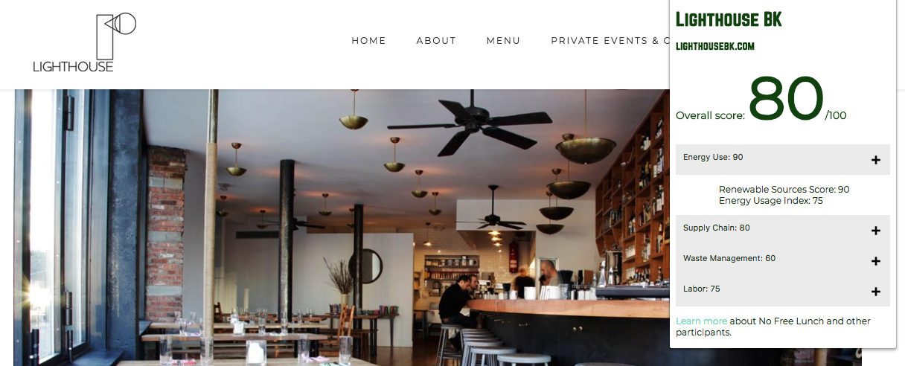

# eat.Responsibly IPK Plugin

This Chrome Extension is modified from the [Responsibly.me](https://www.responsibly.me) extension with the purpose of informing consumers on the fair sustainable practices of local restaurants. 

eat.Responsibly can rate restaurants and other food services based on the following criteria: 

- Energy Use
- Supply Chain Management
- Waste Management
- Labor Practices

These rankings are completely customizable to fit the datasets. For more information, visit [No Free Lunch](https://sleepy-reaches-22861.herokuapp.com/). 

